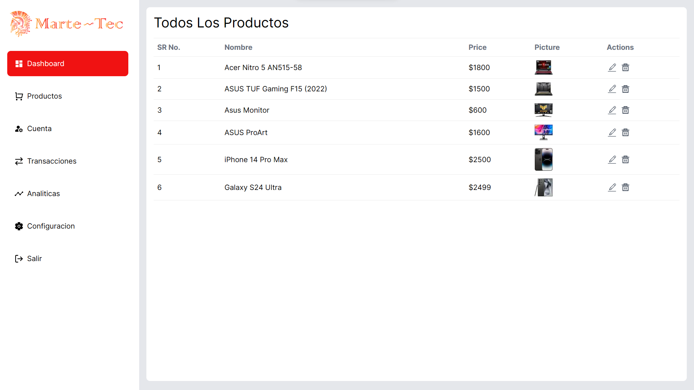

# Como correr el proyecto

Para correr el proyecto se debe tener instalado Node.js y npm, luego se debe correr el siguiente comando en la terminal:
correr el siguiente comando en la terminal:

```bash
npm install
npm run dev
```

# Lista de librerias usadas

- Redux Toolkit
- NextAuth
- React Hot Toast
- React Icons
- Axios
- Mongoose
- Uploadthing Docs
